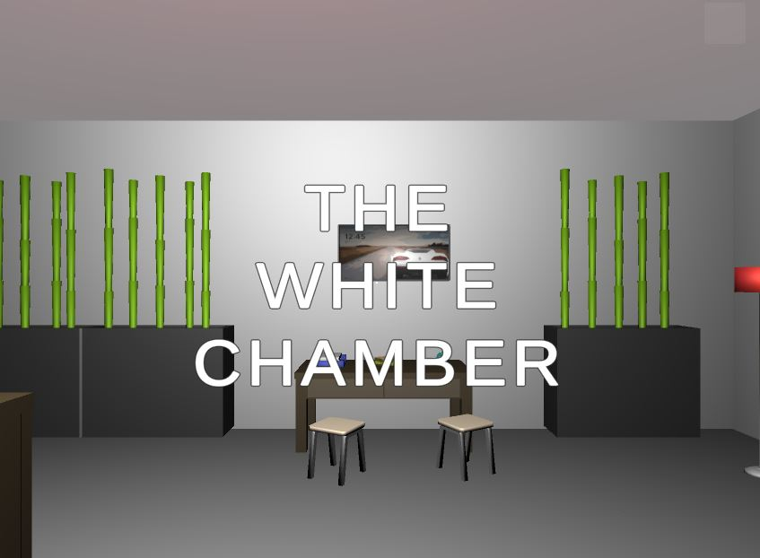

# The White Chamber

## **What is The White Chamber?**
---

The White Chamber is a point-and-click adventure game in the style of early 2000s games such as [The Crimson Room](https://www.youtube.com/watch?v=PlhNR7hRHt4). 

Players explore an seemingly abandoned office room and interact with items to solve puzzles and try to escape. 

There are many different types of interactions in the game, such as:
* Picking up items and adding them to your inventory;
* Switching sound/light on and off;
* Combining items; and
* Moving objects by solving specific puzzles.

These interactions happen when a ray is cast from the player camera and checked against the collision with the intersected object - if the object is an item and the player clicks the mouse button, some sort of interaction will occur.

## **Game Controls**
---

* **WSAD + Mouse Look**: Movement
* **Click**: Interact with item
* **Q/E**: Cycle through inventory items

To combine an item in your inventory with an existing item, make sure that you have the item active in the inventory panel and click the item that you wish to combine it with.

## **Video Demo**
---
A video demo will be added to this GitHub repository once it is made public.

## **Future Work**
---

I would love to add more items and puzzles to the game, and perhaps adding some funny messages for item interactions not necessarily on the critical path for game progression. 

In terms of code, it would be great to refactor the code relating to Items to make it a little more modular, and also break the Game class into several different classes to ensure that there is less logic contained in a single monolithic file.

## **Sources and References**
---

**General**

The arrangement of the items, lighting, interactions of the player with the game world and the general puzzles / game progression are my own personal work. The video game figurines (Shovel Knight and Samus) that are part of the game's puzzles were scanned in by me using photogrammetry.

**Code**

The code was written by me in consultation with the excellent [Unity documentation](https://docs.unity.com/). Where external sources were used, or if there is anything particularly unusual or noteworthy used from the Unity documentation, such code snippets are clearly marked as comments within the code. I would like to give particularly strong thanks to the [Brackeys YouTube channel](https://www.youtube.com/c/Brackeys) and the [GameDev.tv](https://www.gamedev.tv/) website for being invaluable resources when learning the Unity Engine,

**3D Assets**

For the 3D assets comprising the game world aside from the video game figurines, the wonderful [VNB Low Poly Office Set by Leo](https://vnbp.itch.io/low-poly-3d-office-set-vnb) was used.

**Music**

* [Vintage Sci-Fi Lounge Elevator Music](https://www.youtube.com/watch?v=l-gpQks9MME)
* [The Backrooms Ambience](https://www.youtube.com/watch?v=QoHScO6NaEw)
* [Van Sliding Door Sound Effect](https://www.youtube.com/watch?v=QOjnc8ldnS8)

**END**